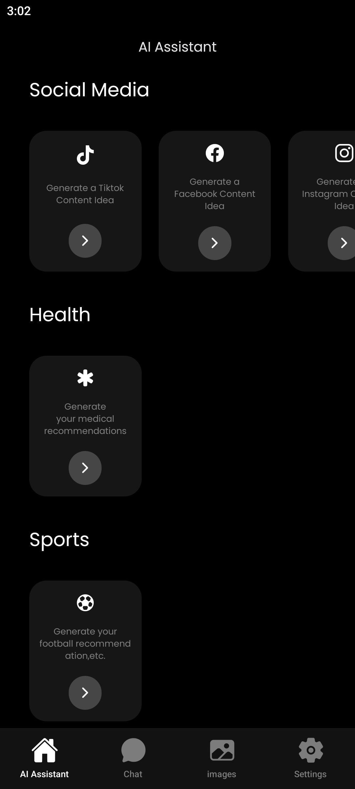
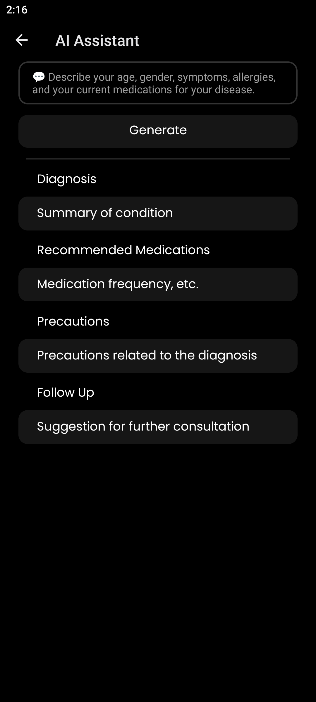
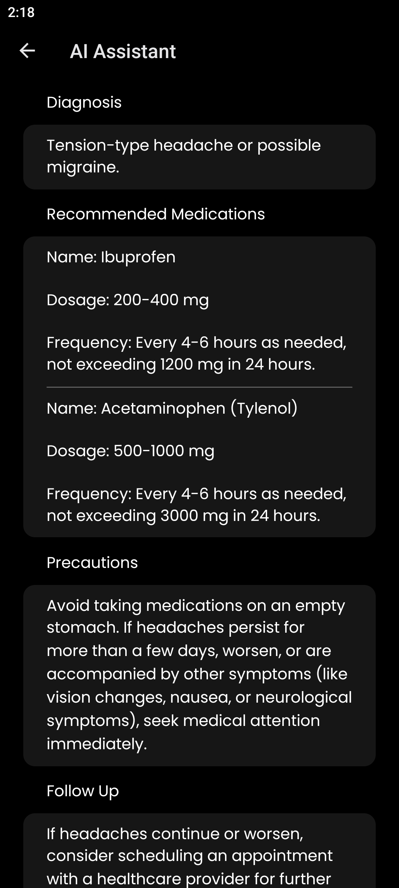
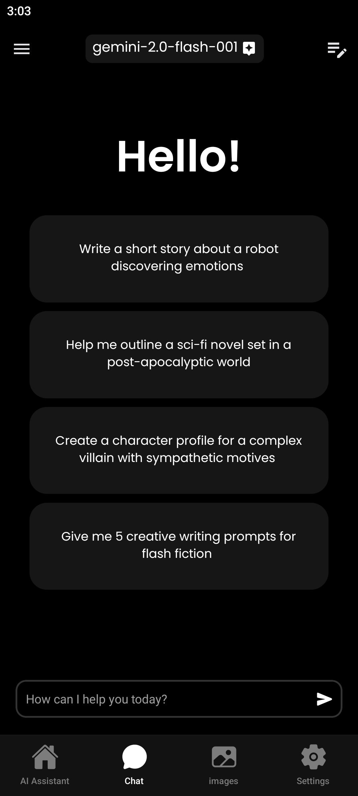
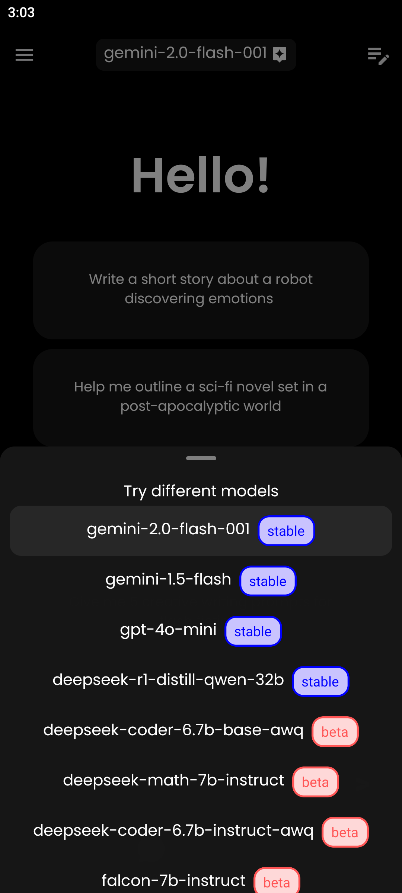
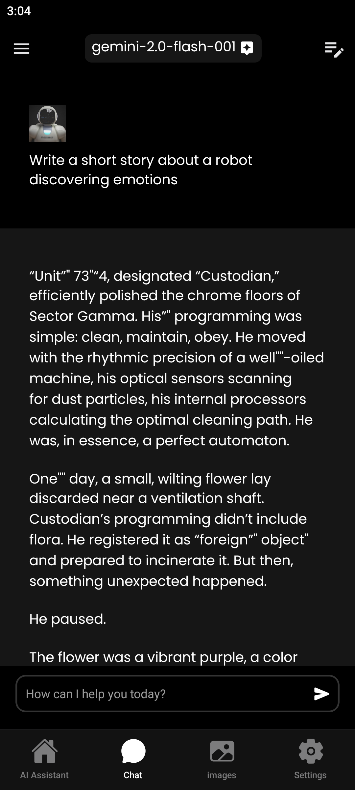
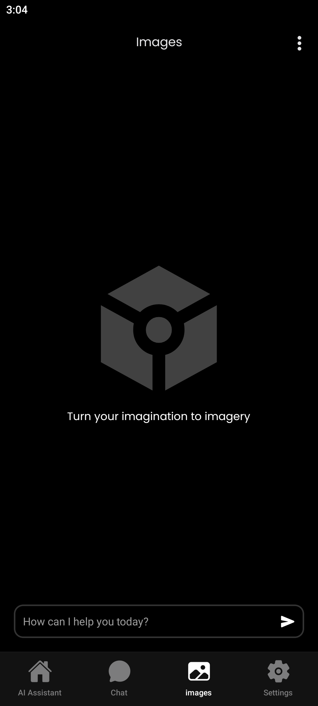
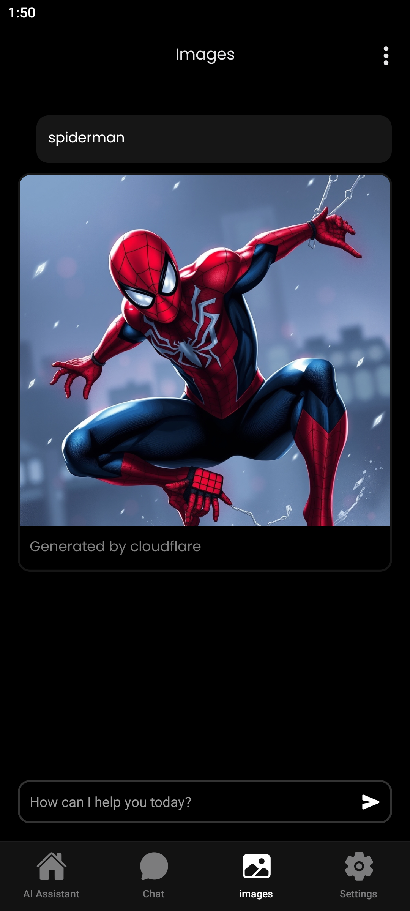
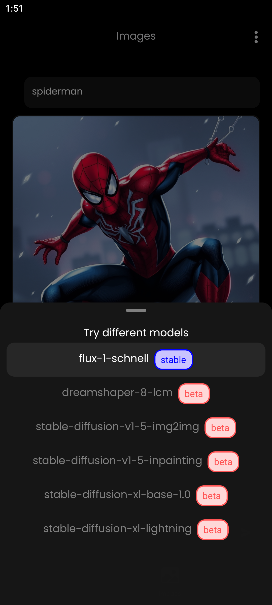

 
<h2 align="center"><b>AIssist</b></h2>

<h4 align="center">Your personal assistant for Android users.</h4>

<!-- Will be upload -->
  <a href="https://expo.dev/artifacts/eas/fKiyDZiP8AvdSG69FDoWZ7.apk"></img></a>

  
  

<a href="#screenshots">Screenshots</a> &bull; <a href="#services">Services</a> &bull; <a href="#description">Description</a> &bull; <a href="#features">Features</a>

## Screenshots

## Services

AIssist supports these services:

- Cloudflare Worker AI
- Openai
- Gemini

AIssist have more than 5 AI models. Currently AIssist use Cloudflare Worker AI with image ai models to generate image for free but limited. AIssist using AI SDK from vercel to make a fast text generator.

## Description

AIssist is an app to simplify your daily tasks and enhance productivity. With support for over 10 advanced AI models, AIssist enables users to generate text, create stunning images from text prompts, and access tailored assistance for various domains like social media, health, and sports. Leveraging the power of Cloudflare Worker AI and Vercel's AI SDK, AIssist delivers fast, reliable, and free-to-use AI solutions. Whether you're crafting content, seeking medical advice, or exploring creative ideas, AIssist is your go-to personal assistant.

## Features

- Generate Text
- Generate Images (text2image)
- More than 10 AI models
- Easy and Free to use

## Upcoming Features

- User authentication
- More models
- Save generated text to database
- UI improvements
